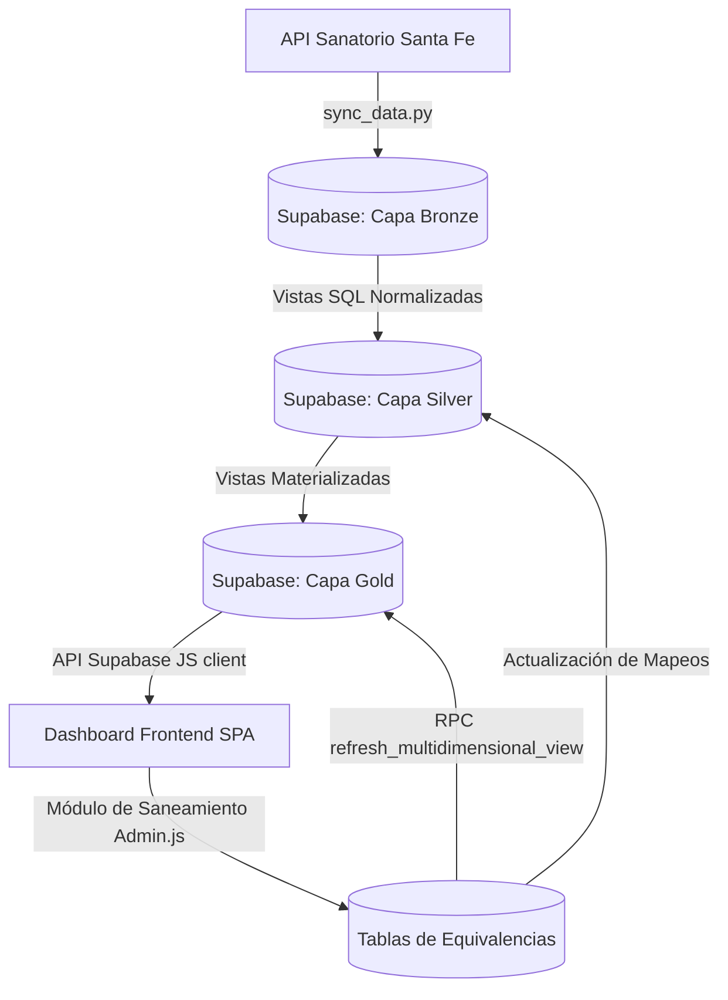

# Documentación General del Sistema: Dashboard BI - Sanatorio Santa Fe

Este documento constituye la **única fuente de verdad** del diseño técnico, arquitectura de datos y lógica de la aplicación del panel de Business Intelligence (BI) para el Sanatorio Santa Fe. Su propósito es servir de referencia y guía estándar para la replicación del sistema en futuras unidades y etapas del sanatorio.

---

## 1. Arquitectura General y Flujo de Datos

El sistema está diseñado bajo una arquitectura de tres capas de datos (Medallion Architecture: Bronze, Silver, Gold) sobre **Supabase (PostgreSQL)**, alimentado por una API REST externa y visualizado mediante una aplicación web Single Page Application (SPA).

---

## 2. Estructura de la Base de Datos (Supabase)

El esquema de datos está alojado en Supabase y dividido en tres esquemas conceptuales principales:
1. `diagnostico_imagenes`: Contiene las tablas Bronze y vistas Silver asociadas a la unidad actual.
2. `silver_shared`: Aloja los catálogos y las tablas maestras de equivalencias que utiliza el panel de administración.
3. `gold`: Contiene las vistas materializadas optimizadas que consume la aplicación web.

### 2.1 Capa Bronze (Datos Crudos / Históricos)
Representa la ingesta directa de la API sin transformaciones.
* **`diagnostico_imagenes.bronze_detalle_di`**: Tabla principal de transacciones a nivel de estudio (registro por paciente). Almacena campos como edad, sexo, localidad, obra social cruda, intermediaria cruda, médico solicitante (crudo), códigos de prácticas y cantidades.
* **Tablas de Agregados**: `bronze_videoendoscopia`, `bronze_tomografia`, `bronze_resonancia`, `bronze_ecografia`. Almacenan resúmenes mensuales históricos de períodos de la API.

### 2.2 Capa Silver (Datos Saneados y Enlazados)
Aplica la unificación de nombres mediante cruces con la base de datos de equivalencias.
* **`diagnostico_imagenes.silver_detalle_di`**: Vista clave. Realiza desgloses automáticos de prácticas (separando por comas/barras) y hace los `LEFT JOIN` con las tablas de equivalencias de `silver_shared`. Aquí se define si una fila `es_estudio` en base a reglas del nomenclador y exclusión de punciones o ecografías mamarias en sedes específicas.
* **Mapeos aplicados en Silver**:
  - Servicio / Sede física: Cruza `servicio` con `silver_shared.silver_sedes_equivalencias`.
  - Obra Social: Cruza `nombre_os` con `silver_shared.silver_os_equivalencias`.
  - Intermediaria: Cruza `intermediaria` con `silver_shared.silver_intermediaria_equivalencias`.
  - Médico Derivante: Cruza `nombre_solicitante` con `silver_shared.silver_derivantes_equivalencias`.
  - Códigos/Prácticas: Cruza `codigo_practica` con `silver_shared.silver_codigos_nomenclador`.

### 2.3 Capa Gold (Datos Agregados Materializados)
Vistas optimizadas en almacenamiento para evitar timeouts y permitir que el frontend cargue instantáneamente.
* **`gold.gold_vw_di_multidimensional_saneado`**: Vista materializada consolidada que consume el dashboard. Agrupa por módulo, sede, tipo de área (Ambulatorio/Internado), obra social saneada, intermediaria saneada, derivante unificado, servicio del derivante, código y nombre limpio de práctica, año y mes.

---

## 3. Mecanismo de Saneamiento de Datos

El saneamiento es dinámico y se controla directamente desde la interfaz de la aplicación.

### 3.1 Carga Dinámica de Pendientes
Para **Médicos Derivantes** y **Obras Sociales**, el panel de control no solo lee la tabla de equivalencias configuradas, sino que realiza consultas dinámicas (usando RPCs como `get_unique_os_from_detail`) en el detalle transaccional. Esto permite listar automáticamente en la interfaz cualquier nombre crudo nuevo que ingrese al sistema para que el administrador pueda unificarlo de inmediato.

### 3.2 Refresco de Caché (Materialized Views)
Dado que los gráficos consumen vistas materializadas (`MATERIALIZED VIEW`), al modificar una equivalencia de saneamiento (como un código, derivante u obra social) la interfaz invoca la función RPC de Supabase:
`refresh_multidimensional_view()`

Esta función realiza las siguientes operaciones en el servidor de base de datos:
1. Detecta si hay códigos nuevos en las transacciones que no existen en el nomenclador y los inserta automáticamente en la tabla maestra como pendientes.
2. Ejecuta un `REFRESH MATERIALIZED VIEW` sobre las 15 vistas materializadas de la capa Gold en secuencia.
> [!NOTE]
> Este refresco toma entre 5 y 8 segundos en completarse en la nube. Al retornar del panel de saneamiento al dashboard principal, se recomienda refrescar la página (F5) tras unos segundos para limpiar la caché de JS del navegador y visualizar la información actualizada.

---

## 4. Pipeline de Sincronización (Python)

El script **`sync_data.py`** se encarga de poblar el sistema de forma automatizada mediante un programador de tareas en el servidor.

1. **Autenticación**: Obtiene un token Bearer desde la API de identidad del Sanatorio.
2. **Consulta incremental**: Identifica la fecha del último éxito (`log_sincronizacion`) y realiza consultas incrementales (Margen: -1 día) para evitar duplicación o pérdida de datos.
3. **Carga en Lotes**: Realiza la carga de datos del detalle en lotes de 200 filas en `bronze_detalle_di` utilizando políticas de inserción conflictiva (`upsert` en base a la clave `me_id, serv_id, ubic_id`).
4. **Actualización**: Ejecuta el refresh de las vistas en Postgres al finalizar con éxito y deja registro de auditoría en la tabla `logs.log_sincronizacion`.

---

## 5. Lógica del Dashboard Frontend (Vite + Vanilla JS)

La interfaz de usuario está construida sin frameworks complejos para mantener un rendimiento y velocidad de carga extraordinarios.

### 5.1 Estructura de Archivos
* **`main.js`**: Enrutador SPA. Controla las sesiones de Supabase Auth, los perfiles de usuario, los permisos y conmuta las vistas (`login`, `dashboard`, `admin`) de forma reactiva escuchando el evento `hashchange`.
* **`Dashboard.js`**: Contenedor principal de la interfaz de usuario. Renderiza el layout, el selector de rangos de fechas (mes/año), el interruptor de comparación interanual y delega el pintado de los gráficos y tarjetas KPI a los componentes específicos.
* **`components/`**: Componentes visuales puros que reciben datos procesados y renderizan elementos de Bootstrap y ApexCharts.
  - `KPICards.js`: Tarjetas de totales dinámicos (estudios totales y por módulo de especialidad) con minigráficos (sparklines) de tendencia.
  - `MainChart.js`: Gráfico de línea principal (Tendencia Mensual de Estudios) con soporte interanual.
  - `DetalleCharts.js`: Gráficos de barras horizontales extensibles para el Top de Prácticas y Top de Médicos Derivantes.
  - `DistributionCharts.js`: Gráficos de distribución secundaria (Obras Sociales, Intermediarias, Sedes, Áreas y Servicios de Médicos Derivantes).

### 5.2 Sistema de Filtros Cruzados Globales
Cuando el usuario interactúa y hace clic en cualquier elemento de un gráfico (ej. una barra de Obra Social, una Sede en el gráfico de dona, o un Servicio Médico en el gráfico de distribución), el sistema activa un **Filtro Global**:
1. Se invoca `toggleFilter(tipo, valor)` en `lib/state.js`, lo que guarda el filtro en el estado global.
2. Se genera un badge de filtro superior dinámico con botón de eliminación (`x`).
3. El cambio de estado notifica a los escuchas y dispara la función `renderAll()` en `Dashboard.js`.
4. `computeViewData()` en `lib/data.js` recalcula en memoria todos los arrays de visualización aplicando las exclusiones dinámicas (ej. si filtramos por "Cardiología" en el gráfico de servicios médicos, el dashboard entero se redibuja mostrando tendencias, prácticas y obras sociales exclusivas de los estudios derivados por el servicio de cardiología).
5. Las barras o segmentos activos de los gráficos cambian visualmente (ej. la barra seleccionada resalta en azul marino y las demás se mantienen en azul normal o gris) para brindar feedback visual inequívoco del filtro aplicado.

---

## 6. Checklist de Replicación para Nuevas Unidades

Cuando se decida expandir el sistema e incorporar una nueva unidad o departamento del Sanatorio Santa Fe, se deben seguir los siguientes pasos:

1. **Esquema de Ingesta**: Crear un nuevo esquema o tablas Bronze en la base de datos equivalentes a `bronze_detalle_di` si la nueva unidad cuenta con una estructura diferente.
2. **Carga en Excel**: Rellenar un nuevo Excel de equivalencias con los códigos del nomenclador, exclusiones de la unidad y sedes mapeadas, y poblarlo en `silver_shared` usando adaptaciones de `load_silver_shared.py`.
3. **Mapeo en Silver y Gold**:
   - Crear la vista `silver_[unidad]_detalle` uniendo las nuevas transacciones con los catálogos de `silver_shared`.
   - Incorporar la nueva unidad a la vista materializada multidimensional `gold_vw_di_multidimensional_saneado` mediante un `UNION ALL` o mediante la creación de una estructura paralela si el negocio lo demanda.
4. **Sincronización**: Añadir los endpoints y credenciales de la nueva unidad a `sync_data.py` (o clonar el flujo en un script secundario) y programar la tarea programada.
5. **Permisos y Dashboard**:
   - Registrar los nuevos módulos/unidades en la configuración de la aplicación (`config.js`).
   - Agregar las opciones de permisos a la vista de administración para poder habilitar o restringir el acceso a los usuarios de forma granular.
